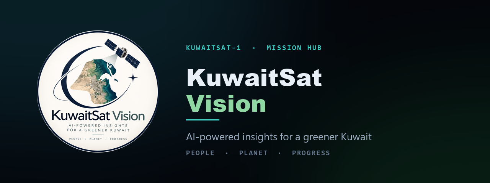

<p align="center">
  
</p>

<h1 align="center">KuwaitSat Green Intelligence</h1>

<p align="center">
  <strong>A research console that takes a Kuwaiti environmental question from
  objective to written study — with a signed-in human at every gate.</strong>
</p>

<p align="center">
  
  
  
  
  
  
</p>

<!-- The CI badge is held back deliberately, not forgotten. .github/workflows/ci.yml
     exists in the working tree but is not yet on main: pushing a workflow file needs
     the `workflow` OAuth scope, which this repo's token does not carry. A badge
     pointing at a workflow that does not exist renders as a failure, and a front page
     that looks broken is worse than one with a badge missing. To enable both:

         gh auth refresh -h github.com -s workflow
         git add .github/workflows/ci.yml && git commit && git push

     then restore the badge block that used to sit here — it is in the git history of
     this file. What the workflow runs is described under "The checks you can run
     locally" below, and you can run all of it by hand today. -->

> [!WARNING]
> **Prototype. Every figure in it is invented.**
> A student capstone for AI for Coding (CODED × KFAS × SACGC). It is **not**
> connected to kuwaitsat.space, it holds **no** real KuwaitSat-1 imagery or
> telemetry, and it secures nothing belonging to KFAS or Kuwait University.
> The site says the same thing in its own words:
>
> *"This is a decision-support platform. It is not an official government
> planning system, it carries no endorsement, and nothing in it should be acted
> on without review by the competent authorities."*

<p align="center">
  <strong><a href="https://kuwait-sat1-hub.vercel.app/">▸ Open the live site</a></strong><br>
  <sub>Deployed on Vercel · database on Supabase · no build step, no bundler, no framework</sub><br>
  <sub>One serverless function, for a nightly cron. Everything else is static.</sub>
</p>

---

## What it does

A researcher signs in, writes a research objective, picks an area of Kuwait and
a period, and presses **Start**. A pipeline of agents runs: it pulls the
acquisition record, reads vegetation and surface temperature, matches the site
against a published Kuwaiti species register, projects the impact with
published coefficients, prices the proposal, and — once a human releases it —
monitors the footprint and writes the study up.

Results land on the map and in the console. Refresh the page and the mission is
still there. Sign in as a different researcher and the first one's work is not
visible, because that isolation is enforced in Postgres rather than in the page.

**The AI never commands the satellite.** It reads stored data and proposes
findings. Every decision stays with the researcher:

> **researcher asks → AI assists → researcher reviews → AI continues**

---

## The pipeline, and the three different agent counts

You will find this project described as having **five**, **six** or **seven**
agents, depending on which file you opened. All three numbers are correct about
different things, and the difference is worth understanding before you read the
code — it is the shape of the system, not a documentation slip.

| # | Agent — the `AGENTS` array in `index.html` | What it does for the researcher | `agent_steps.step_name` |
|---|---|---|---|
| 1 | **Satellite Data** | Finds and retrieves the imagery so you do not open every frame | `satellite_data` |
| 2 | **Environmental Analysis** | Reads vegetation, surface temperature and dust, shortlists zones | `environmental_analysis` |
| 3 | **Species Recommendation** | Matches the site against a published Kuwaiti species register | `recommendation` |
| 4 | **Impact Prediction** | Projects the effect with published coefficients and their ranges | `impact_prediction` |
| 5 | **Visualisation & Costing** | Puts the proposal on the imagery and prices it from your unit rates | `visualization` |
| | ⛔ **Human gate — "Mark as deployed"** | `rcTick()` stops at step 5 and will not continue on its own | — |
| 6 | **Monitoring** | Watches the same footprint after deployment and reports what happened | *(none exists)* |
| | ⛔ **Human gate — "Complete study"** | the report is never written without a person asking for it | — |
| 7 | **Reporting** | Writes the study up: objective, area, data, findings, limits, references | `reporting` |

- **Seven** is what the page renders. `AGENTS` has seven entries.
- **Five** is what runs unattended. `rcTick()` in `index.html` stops itself:
  `if(RC.step>=5){ RC.running=false; ... }   // researcher gate before monitoring`
  — search the file for `researcher gate before monitoring`.
  Agents 6 and 7 each wait for a button. The original prototype hand-off note
  (`site-original/README.txt:52`) counts the pipeline this way and says "let all
  five agents finish".
- **Six** is what the database will record. `agent_steps.step_name` is pinned by
  a `CHECK` constraint to exactly six values
  (`STEP_NAMES` in `js/ksat-workflow.js`, and the `CHECK` in
  `03-security/db/01_tables_rls.sql`). The Monitoring Agent has **no step
  name**, and inventing a seventh throws at insert time. Its output lives in the report instead, as its own section.

The full mapping, including why "Species Recommendation" is stored as
`recommendation`, is in
[`02-back-end/HARVEST.md`](02-back-end/HARVEST.md#5--the-agent-step-copy).

---

## Two tiers, and which half is a security control

| | A signed-out visitor | A signed-in researcher |
|---|---|---|
| Sees | the record: the mission, the map, the sources, the methodology | the instruments: the console, the pipeline, their own missions |
| Rows returned from Postgres | **none — `anon` holds no table grants** | only their own |

The tier layer is **product framing, not secrecy**, and the code says so out
loud — see the header comment of `js/ksat-shell.js`, under *WHAT IS AND IS NOT
A SECURITY CONTROL*. Every demo constant in the page ships to every visitor
and always did; you can undo the tier in DevTools in a few seconds.
What you cannot undo there is row-level security — flip the attribute and you
get **empty** panels, because the emptiness is enforced in the database.

---

## Security posture

Owned by **03 · Security**. Everything below is evidenced in
[`03-security/`](03-security/README.md); the evidence files carry the dates the
checks were run.

**Isolation**
- Row-level security is enabled on all **8 tables of the core schema** —
  `profiles`, `missions`, `mission_runs`, `agent_steps`, `results`, `reports`,
  `mission_collaborators`, `app_settings`
  ([`01_tables_rls.sql`](03-security/db/01_tables_rls.sql)) — and on both
  additional tables in the phase-2 admin/audit file.
- `anon` — the identity the publishable key gives you — is refused on every
  table, every view and every privileged function.
- Grants are **column-level, not table-level**
  ([`03_grants.sql`](03-security/db/03_grants.sql)): `authenticated` may select
  named columns and insert named columns, not `*`.

**The human checkpoint — stated honestly**
- `generate_report` is granted to `authenticated` and **refused to
  `service_role`**. The automation engine holds three write paths and is locked
  out of this one, so **an unattended pipeline cannot sign its own conclusion.**
- `approved_by` is `(select auth.uid())`, read from the verified JWT and never
  from a function argument, so a report cannot be pinned on a colleague.
- **A researcher with DevTools open can call `generate_report` without clicking
  the Approve card.** We tested exactly that rather than waiting for a judge to
  ([`se-m5-checkpoint`](03-security/evidence/se-m5-checkpoint-2026-09-21.md)).
  The guarantee is narrower than the button implies and worth more than it: *no
  report can exist without a named, signed-in human who owns that mission.*

**Prompt injection**
- The researcher's own objective text is screened for instructions aimed at the
  agent (section *4c · PROMPT INJECTION SCREEN* in `js/ksat-integration.js`).
  The screen may **flag and refuse**. It
  may not act on what it finds and may not silently rewrite what the researcher
  wrote — that limit is written into the tool description itself.
- A refusal is logged as an `agent_steps` row with `allowed = false`, so the
  audit trail records what was refused and why.

**Rate limits and budgets** (defaults, held in `app_settings` and changeable
without a deploy)
- 5 missions created per researcher per hour, 20 per day.
- 5 runs launched per researcher per hour.
- 3 runs per mission per hour.
- A hard ceiling of **40 tool calls per run**, as a `CHECK` on
  `mission_runs.tool_calls` — a wall, not a warning.
- A kill switch: `accepting_new_missions`, checked before any rate limit.

**What is served at all**
- The deployment is an **allowlist**, not the repository. `.vercelignore`
  denies everything and re-includes only `index.html`, `site.webmanifest`,
  `vercel.json` and the `api`, `assets`, `css`, `js` and `vendor` directories.
  Before it existed the whole repository was live, which meant the SQL policy
  text, the threat model and a complete ungated second copy of the app all
  returned 200. `vercel.json` adds redirects for those paths as a second belt.

**The one piece of server-side code**
- `api/monitor.js` is a Vercel function run by cron at 02:00 UTC. It calls one
  database function, `public.sweep_stalled_runs(3)`, and decides nothing — the
  rule for what counts as a stalled run lives in SQL, in one place. It refuses
  any request without `Authorization: Bearer <CRON_SECRET>`, and `CRON_SECRET`
  is a Vercel environment variable that is **not** in this repository.

**Transport and secrets**
- Response headers set in [`vercel.json`](vercel.json): CSP, HSTS, `nosniff`,
  `Referrer-Policy`, `X-Frame-Options: DENY`, `Cross-Origin-Opener-Policy`,
  `Cross-Origin-Resource-Policy`, `frame-ancestors 'none'`, `base-uri 'none'`,
  `object-src 'none'`, and a `Permissions-Policy` that turns off fourteen
  device APIs.
- The CSP allows exactly one external origin family — Google Fonts. Everything
  else, including Supabase, is named explicitly. Leaflet and supabase-js are
  **self-hosted in `vendor/`**; there is no CDN.
- `gitleaks` runs over the full history in the automated suite and finds no
  secret. The service-role key does not appear in this repo and lives in the
  n8n credential store.

**What the automated suite says today**
`node 03-security/tests/security-check.mjs` runs 36 checks against the live
system as an anonymous visitor. As of the last run: **33 passed, 3 failed.**
The three failures are `PG-STRUCT`, `PG-MARKUP` and `PG-NUM` — they assert that
`index.html` is byte-identical to `site-original/index.html`. That invariant was
retired on purpose. See the next section; it is not a regression, but the check
has not yet been updated to know that.

---

## The invariant that used to hold, and no longer does

**This README used to say that `index.html` carried "exactly 10 ADDED lines and
nothing else", and that every line of `diff site-original/index.html index.html`
had to begin with `>`. That is no longer true, and keeping the claim would have
been worse than losing the property.**

It was true, and it was valuable while it lasted. The whole integration layer —
auth, persistence, the audit trail, the theme, the shell, Arabic — was built by
adding files and one `<script>` line each, so that deleting those files brought
the original 6,000-line prototype back byte for byte. That constraint is why
every selector in `css/` is prefixed `.ksat-` and why `js/ksat-theme.js` exists
at all: it re-points colours that were hard-coded in the page rather than
editing them.

The page is now edited directly. Run the diff yourself:

```bash
# On Linux or macOS
diff site-original/index.html index.html

# On Windows, index.html may be checked out with CRLF line endings, which makes
# a plain diff report every single line as changed. Strip them first:
diff --strip-trailing-cr site-original/index.html index.html
```

At the time of writing that produces **213 `>` lines, 164 `<` lines and 95
changed hunks**, not additions alone. The numbers will keep moving.

**`site-original/` is therefore no longer a live invariant — it is the
historical baseline.** It is kept in the repository, unchanged, so that any
element, number or source in the original prototype can still be recovered and
compared — and it is kept **out of the deployment**, by three separate
mechanisms: `.vercelignore` does not upload it, `vercel.json` redirects
`/site-original/*` to `/`, and an `X-Robots-Tag: noindex, nofollow` covers the
case neither of those catches. It needs all three because it is a complete,
ungated copy of the app: served, it would show every researcher-only panel to
anybody who guessed the URL. Nothing was removed from the product; it was folded,
routed and re-grouped. The one deliberate removal is the capstone "Meet the
Team" section, taken out on purpose and not to be restored.

If you are a judge who ran the diff before reading this: yes, and this paragraph
was here before you did.

---

## Run it

There is no build step, no `npm install` and no framework. It is a static site.

```bash
git clone https://github.com/t021600-dot/KuwaitSat1Hub.git
cd KuwaitSat1Hub
```

Then either open `index.html` in a browser, or serve the folder over HTTP —
`python -m http.server 8000` will do — which you need if you want the fonts and
the tiles to behave exactly as they do in production.

To point it at your own database, put your Supabase project URL and
**publishable** key into [`js/config.js`](js/config.js). Both are public by
design: the browser has to receive them, so hiding them in a `.env` would be
theatre. **They are safe only because row-level security is on.** Use the
`sb_publishable_…` key format, not the legacy `eyJ…` anon key — the pre-commit
hook in `tools/hooks/` blocks any real JWT in a commit, deliberately, because a
legacy anon key and a service-role key look identical at a glance.

Pushing to `main` puts the **site** live on Vercel in about a minute.

What goes up is not the repository. `.vercelignore` is an **allowlist**: it
denies everything, then re-includes `index.html`, `site.webmanifest`,
`vercel.json` and the `api`, `assets`, `css`, `js` and `vendor` directories.
The per-job folders, `app-retag/`, `site-original/`, `tools/` and every `.md`
file stay in git and off the web. Read the comments at the top of that file
before you add a directory to the site — a directory needs **two** lines, one
to let the walker in and one for its contents, and getting it wrong removes
the site's own stylesheet without a word.

Pushing does **not** apply the SQL. That is run by hand in the Supabase SQL
editor, in order, from [`03-security/db/`](03-security/db/).

### The checks you can run locally

```bash
node --check js/ksat-shell.js          # syntax, any file under js/
node 04-agents/tests/decision.test.js  # 17 checks
node 04-agents/tests/phases.test.js    # 20 checks
node 04-agents/tests/injection.test.js # 35 checks
node 04-agents/tests/automation-panel.test.js   # 38 checks
```

Those four need no network, no secrets and no install, and they are what
[CI](.github/workflows/ci.yml) runs on every push.

Two further scripts need more than that and are **not** in CI:
`node 04-agents/tools/preflight.js` is the demo-night readiness board and
currently reports one FAIL and two TODOs by design — it is a checklist, not a
test. `node 03-security/tests/security-check.mjs` needs network access to the
live site and database.

---

## Where the code lives

The product is **one page** — the research console — with the security, agent,
theme and language layers attached from the outside rather than woven in.

```
index.html                 THE SITE. ~6,000 lines: the 3D globe, the orbit view,
                           imagery compare, charts, the agent pipeline, 16
                           numbered sources, EN/AR throughout.
site-original/             The historical baseline of that page. See above.
site.webmanifest           Installable-app metadata, icons from assets/brand/.
vercel.json                Security response headers, redirects, cache policy
                           and the nightly cron schedule.
.vercelignore              An ALLOWLIST of what Vercel may upload. Deny
                           everything, then re-include the app. See below.

css/                       Hand-written, no preprocessor. Every selector is
                           prefixed .ksat- so it cannot collide with the page.
  ksat-integration.css       the sign-in gate and the identity bar
  ksat-shell.css             the shell, the tier panels, the checkpoint card
  ksat-theme.css             the ESA/NASA visual layer
  ksat-agency.css            the structural rebuild — ground, boxes, air, scale
  ksat-detail.css            interaction and finish: the states a thing is in
  ksat-editorial.css         hero, footer and editorial composition
  ksat-brand.css             the emblem and wordmark
  ksat-assistant.css         the corner assistant
  ksat-tour.css              the guided tour's spotlight, offer and HUD

js/                        Plain browser JavaScript in IIFEs. No modules, no
                           bundler, no framework.
  config.js                  Supabase URL and publishable key (public by design)
  ksat-integration.js        auth, persistence, the audit trail, the injection
                             screen, the approved tool list
  ksat-workflow.js           the agent workflow and the step budget
  ksat-shell.js              the two tiers and the chapter navigation
  ksat-i18n.js               Arabic, and the language switch
  ksat-theme.js              re-points colours hard-coded in the page's own JS
  ksat-density.js            folds long text without removing any of it
  ksat-motion.js             scroll transitions, off under prefers-reduced-motion
  ksat-assistant.js          the corner assistant for visitors and researchers
  ksat-tour.js               the guided tour — spotlight, keyboard, announcements

api/                       The one piece of server-side code in the project.
  monitor.js                 GET /api/monitor, run by Vercel Cron at 02:00 UTC.
                             It calls public.sweep_stalled_runs(3) and reports
                             how many runs it closed. It decides nothing; the
                             rule for what counts as stalled lives in SQL.

vendor/                    supabase-js and Leaflet, self-hosted. No CDN.
assets/brand/              Emblem, favicons, social preview, this README's hero.
tools/hooks/               The pre-commit hook that blocks a JWT.

01-front-end/  02-back-end/  03-security/  04-agents/
                           Each member's own documentation, SQL, tests and
                           evidence. Read 03-security/README.md for the security
                           work and 04-agents/GUARDRAILS.md for the agent limits.

app-retag/                 A parallel multi-page build of the same product.
                           PRESERVED, not dead: a full screen set with a
                           swappable data layer, and the fallback if anything in
                           the single-page build goes wrong.
```

*This map was written by listing the directories rather than from memory. If a
file appears here that is not on disk, or the reverse, the directory is right
and this map is stale — please fix it in your next pull request.*

---

## The team

**Four people, four jobs.** Owning a job means **you answer first** — not that
you do it alone. Jobs can overlap; ownership cannot.

| Job | Owner | Owns | GitHub |
|---|---|---|---|
| 🖥️ **01 · Front end** | **Retag** | The screens, the forms that answer, the phone-portrait pass | — |
| 🗄️ **02 · Back end and data** | **Hind** | The tables, accounts, records, the run log | — |
| 🔐 **03 · Security** | **Mariam Madouh** | Row-level security, secrets, validation, the AI audit — **[full role →](03-security/README.md)** | [`@t021600-dot`](https://github.com/t021600-dot) |
| 🤖 **04 · Automation and agents** | **Dana** | The workflow, the agents, the guardrails, the tools | — |

> **Retag, Hind and Dana: replace the `—` in the GitHub column with your own
> username in your first pull request.** It is left blank rather than guessed,
> because a wrong handle on a public front page points at a stranger. Correct
> the spelling of your own name in the same edit if it is wrong.

Shipping and the demo are shared: there is no fifth job. The live URL and the
Vercel deploy are Hind's; checking the live site on a laptop that did not build
it is Retag's; the backup screen recording is Dana's; the two rehearsals are all
four. **What is on `main` is what is live.**

Working rules, branch prefixes and the review convention:
[`CONTRIBUTING.md`](CONTRIBUTING.md).

---

## Data, provenance and credits

Every factual claim on the site is numbered and traceable. The **16 numbered
sources** behind those claims are listed in full, with URLs and with what each
one supports, in [`CREDITS-AND-SOURCES.txt`](CREDITS-AND-SOURCES.txt). They
include the KuwaitSat-1 project site, the Kuwait University launch and mosaic
announcements, the 2023 Small Satellite Conference paper on the mission, the WMO
verification of the Mitribah temperature record, World Bank country indicators,
and four peer-reviewed papers on Kuwaiti xeric species and urban tree cooling.

What is **not** real, and is labelled as such on the site itself:

- All mission, imagery, vegetation, cost and impact figures are **invented for
  the demonstration**. No KuwaitSat-1 photograph is copied into this repository;
  the acquisition entries record the real acquisition and link to the publisher.
- No live telemetry. Nothing here commands or receives from any spacecraft.
- All audio is synthesised in the browser with the Web Audio API. No recording
  is used or implied to be from any agency or launch provider.
- This prototype is not affiliated with Kuwait University, KFAS, CITRA or the
  KuwaitSat-1 project, carries no endorsement and no planning authority.

Typefaces: Archivo, IBM Plex Sans, IBM Plex Mono, Inter, Noto Sans Arabic and
Readex Pro, served by Google Fonts. Maps: Leaflet with OpenStreetMap and CARTO
tiles. Database and auth: Supabase. Hosting: Vercel.

Security reports: [`SECURITY.md`](SECURITY.md). Citation metadata:
[`CITATION.cff`](CITATION.cff).

---

## Licence

[MIT](LICENSE) © 2026 KuwaitSat Green Intelligence capstone team.

The licence covers the **code and documentation in this repository**. It does
not cover the third-party sources cited above, the vendored libraries under
`vendor/` (which carry their own licences), the KuwaitSat-1 photographs held by
the KuwaitSat-1 project, Kuwait University and their press publishers, or the
team photograph, which was supplied for this academic presentation only.

---

<div dir="rtl" lang="ar" align="right">

## نظرة عامة

**«كويت سات — رؤية خضراء»** منصّة بحثية تجريبية تأخذ سؤالاً بيئياً كويتياً من
صياغة الهدف حتى دراسة مكتوبة، مع بقاء القرار في يد باحث مسجَّل الدخول في كل
مرحلة.

> **نموذج أوّلي وبيانات مُفترضة بالكامل.** مشروع تخرّج طلابي ضمن برنامج
> AI for Coding (كوديد × مؤسسة الكويت للتقدّم العلمي × المجلس الأعلى للتخطيط).
> غير مرتبط بموقع kuwaitsat.space، ولا يحتوي على أي صور أو بيانات حقيقية من
> القمر الصناعي كويت سات-1، ولا يؤمّن أي نظام يخصّ مؤسسة الكويت للتقدّم العلمي
> أو جامعة الكويت. ليست منصة تخطيط حكومية رسمية ولا تحمل أي اعتماد رسمي.

الموقع يعمل بالعربية والإنجليزية بالكامل مع دعم الاتجاه من اليمين إلى اليسار.
عزل بيانات كل باحث مفروض داخل قاعدة البيانات عبر Row Level Security، لا داخل
الصفحة. والوكلاء الآليون يقترحون ولا يقرّرون: التقرير النهائي لا يُكتب إلا
بطلب إنسان مسؤول عن المهمة.

**[افتح الموقع ▸](https://kuwait-sat1-hub.vercel.app/)**

</div>
